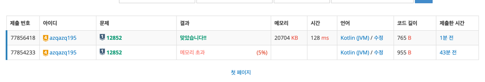

# 문제

- 문제 번호: 12852
- 난이도: 실버 1

---

## 풀이

숫자 1, 0번 순서 부터 시작해서 다음 순서에 올 수 있는 최소 값을 구한다.

1. 1 더하기
2. 2 곱하기
3. 3 곱하기

첫번째 연산:\
1 2 3 4 5 6 7 8 9 10\
0 1 1 0 0 0 0 0 0 0

두번째 연산:\
1 2 3 4 5 6 7 8 9 10\
0 1 1 2 0 2 0 0 0 0

문제점:\
N에 도달할 때 까지 10^6 길이의 배열을 전체 순회 해야한다\
시간 복잡도를 달성하지 못할 것 같다.

---

숫자 N부터 시작해서 문제대로 연산을 수행한다. 숫자 1에 도달한 경우 멈춘다.

1. 1 빼기
2. 2로 나누어 떨어지는 경우 2로 나누기
3. 3으로 나누어 떨어지는 경우 3으로 나누기

수행 횟수, 연산을 수행한 숫자들을 기록해야 함으로 queue를 사용한다.

1. 최초 Queue에 N 을 넣는다.
2. 세가지 연산의 수행 결과를 다음 Queue에 넣는다.
3. 1이 되는 경우 수행 횟수와 연산을 수행한 숫자를 출력한다.

순서를 기억하기 위해 각각의 작업마다 큐를 생성해서 저장하였으나, 메모리 초과로 실패하였음.

---

각각의 작업마다 큐를 사용하지 않고 연산을 수행한 숫자를들 기록해야 한다.\
수행 횟수를 기록하는 `dp` 배열, 이전 index를 기록하는 `trace` 배열 두개로 기록한다.

## 결과

